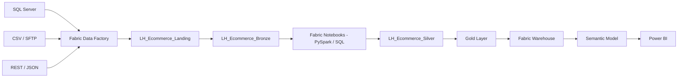

# Solution Architecture

## High-Level Flow

## Medallion Architecture

**Landing:** incoming source extracts before ingestion.

**Bronze:** raw source data with minimal transformation.

**Silver:** cleaned, standardized and validated data.

**Gold:** business-ready fact and dimension structures.

## Current Fabric Components
- Workspace: `WS_Ecommerce_DataPlatform`
- Landing Lakehouse: `LH_Ecommerce_Landing`
- Bronze Lakehouse: `LH_Ecommerce_Bronze`
- Pipeline: `PL_Ingest_Ecommerce_Bronze`
- Customer copy activity: `CP_Customers_To_Bronze`

## First Implemented Flow
`LH_Ecommerce_Landing/Files/customers.csv` → `PL_Ingest_Ecommerce_Bronze` → `dbo.customers` in `LH_Ecommerce_Bronze`.

The first execution successfully read and wrote **5,005 customer records**.

## Design Principles
- Separate ingestion from transformation.
- Preserve source data in Bronze.
- Apply business rules in Silver/Gold.
- Prefer reusable metadata-driven orchestration.
- Design for incremental processing.
- Make data-quality failures observable and auditable.
