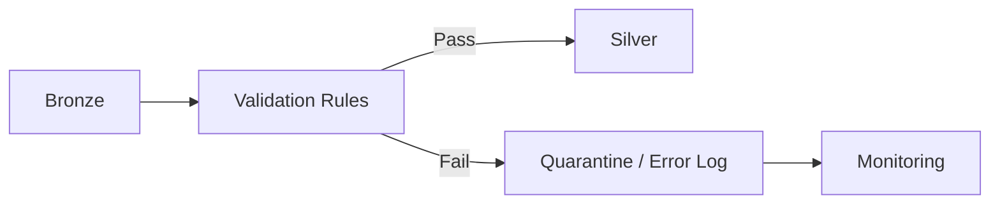

# Data Quality Strategy

The source data intentionally contains controlled quality issues so the project demonstrates real data-engineering validation.

| Domain | Rule | Expected Action |
|---|---|---|
| Customer | CustomerID not null | Reject/quarantine |
| Customer | Valid email format | Flag/quarantine |
| Customer | CustomerID unique | Deduplicate |
| Product | ProductID unique | Deduplicate |
| Product | UnitPrice >= UnitCost | Flag/reject |
| Sales | OrderID unique | Deduplicate |
| Sales | CustomerID exists | Reject/quarantine |
| Sales | ProductID exists | Reject/quarantine |
| Sales | Quantity positive | Reject/quarantine |
| Inventory | Stock values non-negative | Flag/reject |
| Returns | OrderID exists | Reject/quarantine |
| Returns | RefundAmount non-negative | Reject/quarantine |

## Data Quality Flow

## Future Quality Metrics
- Total records
- Valid records
- Invalid records
- Duplicate records
- Null-key records
- Referential-integrity failures
- Processing timestamp
- Pipeline/run ID
